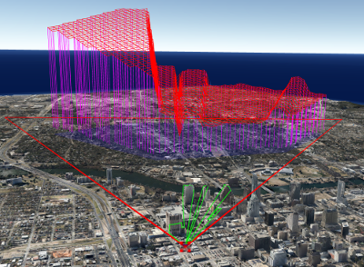

# Altizure Sandbox 3D SDK 更新日志

### 2.10.1
__发布时间:__
2019年4月29日

__改进:__
* 增加 [rotate 手势](https://docs.microsoft.com/en-us/windows/desktop/wintouch/windows-touch-gestures-overview) 可以左右旋转模型。与现有手势不冲突。

### 2.9.3
__发布时间:__
2019年4月23日

__新功能:__
+ 增加实时视频融合，可用于将实时监控视频流与三维模型融合。

### 2.9.1
__发布时间:__
2019年4月17日

__新功能:__
+ 多可视域分析`范例 5.12`, 多个视角下的可视区域分析。
+ 增加照片融合`范例 5.13`，可将用于生成三维模型的照片和三维模型融合显示。三维模型默认不具备该功能，如需开通该功能，请与`Altizure`商务部门联系。

__改进:__
* 更新`范例2.6` 文字顶部可能存在被截取一小段，使用`margin`避免该瑕疵。
* 在裁剪和水面功能中，使用`crop(boundary, isInner = false)`的情况下，不会对boundary内部造成改变。

### 2.8.13
__发布时间:__
2019年4月12日

__缺陷修复:__
* 修复改变朝向对 focus() 造成的问题
* 修复 importPhotos() 可能造成的崩溃
* 修复初始视角垂直于地面可能造成的初始视角无法被正确恢复


### 2.8.8
__发布时间:__
2019年4月8日

__新功能:__
* 背景的 `opacity`, `color`, `image`, 增加了实时修改的功能，更新了范例1.5，演示如何使用这些接口.


### 2.8.7
__发布时间:__
2019年4月3日

__新功能:__
+ 所有 `PlaneMarker` 类的 non-sprite 状态增加了对 `fixedSize` 的支持。

__改进:__
* 使用localStorage缓存常用的graphql请求，以减少加载时的等待时间。

__缺陷修复:__
* 合并对ip位置的重复查询。

### 2.8.5
__发布时间:__
2019年3月29日

__新功能:__
+ 增加範例 `Project/6.8 Water Edit`多片水面编辑。

__改进:__
* 重叠的多片可视域，可视角度越多，绿色会越深。

__缺陷修复:__
* `sandbox.destruct()` 会导致其他的 `sandbox` 中 `ObjMarker`的control无法使用。


### 2.8.3
__发布时间:__
2019年3月25日

__新功能:__
+ 增加範例 `6.10 Interactive Distance Measure` `Analysis`目录下的可交互距离量测工具。
+ 增加实时视频流的实景融功能（包含硬件方案，请咨询Altizure商务部门）

__改进:__
* 在 example 右下角添加链接到 github 代码的按钮。
* 优化了LOD的加载策略，降低CPU消耗

__缺陷修复:__
* IE11 加载实景模型兼容性问题

### 2.7.3
__发布时间:__
2019年3月12日

__新功能:__
+ `altizure-plugin-geosystem` 支持对`ObjMarker` 建立局部坐标系。
+ 增加範例 `5.11 Camera Move Path` 相机移动路径，可以在指定路径上匀速移动。
+ 增加範例 `7.5 Plugin Shapefile` 导入 `shapefile` 功能。[范例 7.5](https://altizure.github.io/sdk.examples/7-5-plugin-shapefile/index.html)
+ 增加範例 `6.9 Floor Distinguish` 建筑楼层单体化示例。[范例 6.9](https://altizure.github.io/sdk.examples/6-9-floor-distinguish/index.html)

### 2.7.2
__发布时间:__
2019年3月10日

__新功能:__
* 增加 `DemMarker` 支持导入符合`wmts`标准的地形数据（高程图及正射图）。

### 2.6.1
__发布时间:__
2019年3月7日

__新功能:__
* 裁剪与视频融合功能可以共存。参考範例7.3。

### 2.5.10
__发布时间:__
2019年3月4日

__缺陷修复:__
* 修复部分 `PlaneMarker` 及其继承类的初始化时闪烁的问题。
* 修复部分 `AltizureProjectMarker` 的位置不准确，或者 fence 位置不准确。

__新功能:__
* 增加 6.8 创建/修改水面范例。

### 2.5.6
__发布时间:__
2019年2月22日

__缺陷修复:__
* 修复部分 `AltizureProjectMarker` 的 `focus` 视角和网站设置的封面图案不一致。
* 修复部分 `AltizureProjectMarker` 的 `包围盒与模型不一致。

__新功能:__
* 增加范例 2.15： LOD 点云项目显示。
* 增加点云 `pointSize` 接口，调整点的大小。
* 增加 10.5 Tool-tip 范例。

__改进:__
* 根据功能，重组范例列表。

### 2.4.16
__发布时间:__
2019年1月24日

__改进:__
* `PlaneMarker` （以及其继承类包括 `CanvasTagMarker`, `Tagmarker` 等） 增加了 `color` 接口，用来改变图片底色； `pinColor` 接口改变图片下方指针颜色。

### 2.4.14
__发布时间:__
2019年1月24日

__缺陷修复:__
* 修复包含sandbox的 `div` 在 `scroll` 之后，只有局部处于window中，`Marker`鼠标交互事件位置不准确。

### 2.4.13
__发布时间:__
2019年1月24日

__缺陷修复:__
* 修复 `Marker::euler::y` 在 `-PI` 和 `PI` 附近有抖动，取值及设定值不正常。

### 2.4.12
__发布时间:__
2019年1月23日

__缺陷修复:__
* `ObjMarker` 默认 `diffuse` 颜色由蓝色调为白色。当 `map_Kd` 与 `Kd` 同时存在，`Kd` 不生效。
* VisibilityMaterial 在使用 Material Array 的模型中显示不正常。

### 2.4.11
__发布时间:__
2019年1月9日

__缺陷修复:__
* 部分导入模型纹理错误。
* 切换页面后粒子效果显示不正常。

__新功能:__
+ [範例2.14](https://altizure.github.io/sdk.examples/2-14-add-tubeline/)，`PolyTubeLineMarker`，类似 fence，可自定义纹理、动画等风格。

### 2.4.10
__发布时间:__
2019年1月3日

__缺陷修复:__
* 加载项目时地球交互可能突然跳很远。
___

### 2.4.9
__发布时间:__
2018年12月28日

__改进:__
* `phong`渲染增加了对导入模型的透明材质的支持。

### 2.4.7
__发布时间:__
2018年12月24日

__改进:__
* 增加了对导入模型的 `emissive map`, `specular map` 的支持。
* 减小56KB`sdk`冗余。

___

### 2.4.6
__发布时间:__
2018年12月21日

__改进:__
* 优化CPU使用，altizure binary 解压全部转移至子线程。
* `PlanarPatchMarker` 两面都可接受交互事件。
* 增加了对导入模型的透明材质的支持。

__缺陷修复:__
* 清理部分内存泄露。
- NASA 月球卫星图资源失效，暂时取消範例1.4。可使用自有月球资源实现相同效果，参考範例1.7。

### 2.4.5
__发布时间:__
2018年12月10日

__缺陷修复:__
* `CanvasTagMarker` lost interaction after the sandbox is destructed and re-created.

### 2.4.3
__发布时间:__
2018年12月10日

__改进:__
* 再次改进由于bbox引起的拉近视角后，模型变糊的问题。


### 2.4.2
__发布时间:__
2018年12月7日

__改进:__
* 加速第一次 Altizure Project Marker 加载时间 1～2.5秒。


### 2.4.1
__发布时间:__
2018年11月30日

__改进:__
* 避免 `CanvasTagMarker` 的图形被拉伸。

__新功能:__
+ 範例 1.6, 设置初始化模型质量，以节省硬件资源。只能在初始化 sandbox 时使用，后续更改将无效。

+ 範例 1.7 自定义使用符合 WMTS 标准的地图服务。


### 2.3.2
__发布时间:__
2018年11月29日

__改进:__
* 厘清 `PolyFenceMarker` 中 `texture`, `alphaMap`, `color` 这三个的逻辑关系 (altizure issue #230)`。texture` 为彩色纹理，`alphaMap` 为透明掩码，`color` 为底色。 `範例2.4`更新。

__新功能:__
+ `PlanarPatchMarker` 多边形面片标注。每个面片的边界点存在于同一平面，面片边界不应自交。面片可以有任意倾斜角度。
+ `範例 2.13` 测量任意倾斜角度（包括立面）多边形的`周长`与`面积`。

+ `VideoProjectorMarker` 视频投影标注。类似于 `CameraMarker` ，并携带一个视频文件，并将视频文件投影到实景模型上。
+ `範例 7.3` video fusion 视频融合。可以将一段视频作为 LOD 实景模型的动态纹理。


### 2.2.3
__发布时间:__
2018年11月27日

__缺陷修复:__
* 修复 CanvasTagMarker 高度尺寸无效。

___


### 2.2.2
__发布时间:__
2018年11月26日

__改进:__
* 增加了`PolyFenceLineMarker`的透明通道 alphaChannel, 範例2.4更新。

__新功能:__
+ LightBeamMarker 範例2.10 更新。

___

### 2.2.1
__发布时间:__
2018年11月23日

__新功能:__
+ LightBeamMarker 增加 opacity 和交互事件。（altizure issue #228）

___

### 2.1.2
__发布时间:__
2018年11月22日

__缺陷修复:__

* 拉近相机时，有些项目会变模糊。（engine issue #55）

___


### 2.1.1
__发布时间:__
2018年11月21日

__範例改动:__

* 【範例2.1.1】 项目不会默认导入Altizure网站上的裁剪结果。在marker initialize完成后，可以使用marker.loadCropMask()来导入。
* 【範例4.5】 在部分IOS设备，高度alt 的获得延迟较高，可以加入一些时间间隔来等待高度的更新。
* 【範例5.8， 5.9】 可视域分析进行了优化，加入不可视部分以红色表示，去掉了与该分析无关的 color, intensity, penumbra, decay 参数，并大幅提高了fps。使用方法也小幅度调整，请参考範例。


___


### 0.2.24
__发布时间:__
2018年6月20日

__新功能:__
* 新版的`sandbox.camera.lookAt`，可以调整camera使得marker在视野中心。增加了[範例5.10](https://altizure.github.io/sdk.examples/5-10-camera-lookat/)。

__改进:__
* 优化了`PolyFenceLineMarker`的贴图逻辑，避免贴图错误。

__缺陷修复:__

* 修复了IE11对 `Math.log2` 未定义的报错。

___

### 0.2.22
__发布时间:__
2018年6月11日

__新功能:__
* `PolyLineMarker` 增加了动画，以及可选的纹理。可以通过调整`marker.style{animation, textture}`设置不同效果。 [範例2.4](https://altizure.github.io/sdk.examples/2-4-add-polyline/)
    ```
    /**
      * set the style of the fence
      * @public
      * @param {object} _style
      * @memberof PolyFenceLineMarker
      * @example <caption> Set the style </caption>
      *  polyFenceLineMarker.style = {
      *    texture: 'fence', // 'fence', 'arrow' or an image file url
      *    color: 0xffffff,
      *    animation: 'horizontal', // or 'verticle', 'none'. default 'hortizontal'
      *    opacity: 1.0
      *  }
      */
      set style (_style){}
    ```
* 根据选取的(不少于)三个点作为水平面，调整marker的的向上方向，`Marker::orientationByHorizontalPoints`
    ``` 
    /**
      * get the realigned orientation from horizontal points
      * @param {LngLatAlt[]} pts 
      * @param {bool} flip
      * @public
      * @returns {Quaternion}
      * @memberof Marker
      */
      orientationByHorizontalPoints (pts, flip = false)
    ```
* 高速测量平面面积，在不需要体积测量时使用 `GeometryUtils::areaByLngLatAlts`
    ```
    /**
      * @param {LngLatAlt[] | PolygonBaseMarker} pts - boundary points
      * @returns {Number} - squared meters
      */
      function areaByLngLatAlts (pts) {}
    ```
* 判断一个点（投影到地表后）是否在polygon范围内 `GeometryUtils::checkPtsInPoly`
    ```
    /**
      * @param {LngLatAlts} pts
      * @param {LngLatAlts} poly - conter clock wise boundary
      * @returns { bool[] } - whether the points are in the poly
      */
      function checkPtsInPoly (pts, poly) {}
    ```

__改进:__
* 增加autoScale範例 [范例 2.1.2](https://altizure.github.io/sdk.examples/2-1-add-project-autoScale/index.html)

__缺陷修复:__

___

### 0.2.20
__发布时间:__
2018年5月24日

__新功能:__
* Tag 类 Marker 增加 `isSprite` 属性，区分是否总面向镜头。更新 [范例 2.2*](https://altizure.github.io/sdk.examples/2-2-add-tag/index.html)。
* Tag 类增加 `pivot` -- 面向镜头时的旋转中心，详见[文档](http://docs.altizure.cn/zh-hans/docs/user_docs/web/TagMarker.html#pivot)。
* `AltizureProjectMarker` 初始化选项 `autoscale: {number | bool}` 自动缩放CAD类模型。[范例 2.1.2](https://altizure.github.io/sdk.examples/2-1-add-project-autoScale/index.html)
* 根据天际线的区域限高。[范例 6.6](https://altizure.github.io/sdk.examples/6-6-skyline/index.html)
    
    

__改进:__
* 保留主站裁剪效果。
* 加入cdn自动发布流程。
* 集中处理离线渲染。
* 提高quality上限。
* 添加瓦片bbox显示接口 showTileBBox。
* CameraMatrix重构及用例测试。

__缺陷修复:__
* 当有重叠出现，positionsAltitude 返回错误高度。
* GeoSystem 对齐后， Marker::position 未更新。
* CAD模型的材质显示错误。
* Marterial array 导致的 marker::destruct 报错。
* 销毁项目模型时释放裁剪Mask内存。

___

### 0.2.5
__发布时间:__
2018年4月9日

__新功能:__
* 区域标注 Zone Marker。[范例 2.11](https://altizure.github.io/sdk.examples/2-11-add-zone/index.html)
* 建筑对象化。 [範例 6.4](https://altizure.github.io/sdk.examples/6-4-objectation/index.html)
* 标注聚合。[範例 6.5](https://altizure.github.io/sdk.examples/6-5-marker-cluster/index.html)
* 质量-效率平衡选项 sandbox.quality。
* 高进度投影坐标系 GeoSystem。
* CAD转换
* 交互式可视域分析。[範例5.9](https://altizure.github.io/sdk.examples/5-9-interactive-visibility/index.html)

__改进:__
* threejs 更新至0.91.0
* 提高渲染效率。

__缺陷修复:__
* LightBeam color 接口，接受string类型。

___

### 0.1.62

__发布时间:__
2018年2月8日

__新功能:__
* Shadow Map 和通视分析。[范例 5.8](https://altizure.github.io/sdk.examples/5-8-visibility-analysis/index.html)

__改进:__
* 提高渲染效率。

__缺陷修复:__
* 修复触碰手势和鼠标点击事件无响应的bug。
